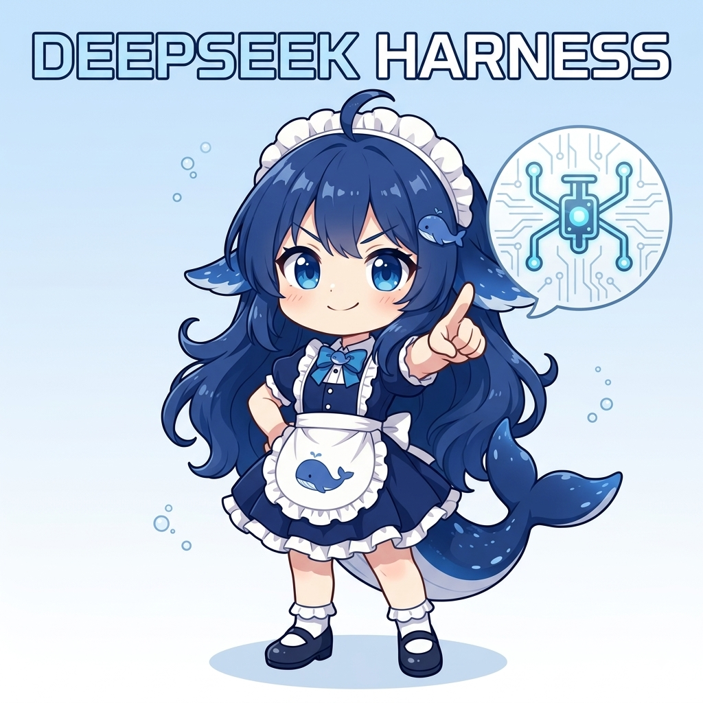

<h1 align="center">
  
  <br />
  DSH Desktop
</h1>

<p align="center">
  A minimal macOS desktop shell for
  <a href="https://github.com/deepseek-ai/deepseek-harness">DeepSeek Harness</a> (dsh) —
  double-click to launch, no terminal or browser needed.
</p>

<p align="center">
  <a href="README.zh-CN.md">简体中文</a> ·
  <a href="LICENSE"></a>
  
  <a href="https://github.com/ninipa/dsh-desktop/releases"></a>
  <a href="https://github.com/ninipa/dsh-desktop/actions"></a>
</p>

DSH Desktop wraps the official DeepSeek Harness Web UI into a native macOS app. Launch the app and it **starts `dsh web` for you** on a random loopback port; quit the app and it **stops the service cleanly** — no manual `dsh web`, no terminal, no orphan processes.

It does **not** bundle dsh — instead it launches the `dsh` you already have installed on your system, so it automatically follows upstream as you run `npm update -g @deepseek-ai/dsh`.

## Why not bundle dsh?

Most desktop wrappers **package a full copy of dsh** — 20+ `@deepseek-ai/dsh-*` packages plus native modules — inside the `.app`. DSH Desktop deliberately does the opposite: it launches the `dsh` you already have.

| | Bundled dsh | DSH Desktop |
|---|---|---|
| **Upstream updates** | Wait for the author to rebuild and release a new app | `npm update -g @deepseek-ai/dsh`, relaunch — done |
| **App size** | Hundreds of MB (Electron + the whole dsh dependency tree + native modules) | Electron shell only — no dsh tree shipped |
| **Duplicate install** | A second dsh copy hides inside the app, version-split from your CLI | Reuses your global dsh — one copy, one version |
| **Upgrade control** | Locked to whatever version the author pinned | You choose when to upgrade — hold back during RC churn if you like |
| **Data** | May share or duplicate your `~/.dsh` | Isolated `DSH_HOME`, never touches `~/.dsh` |

dsh is a fast-moving developer preview: upstream ships breaking changes within days. Bundling it turns every upstream change into a rebuild you must wait for. Spawning the dsh you already installed keeps this shell tiny, always current, and under your control.

> [!IMPORTANT]
> This is an unofficial community wrapper. It depends on the rapidly evolving `@deepseek-ai/dsh` (currently `0.1.0-rc.x`, developer preview — the upstream explicitly warns about breaking changes). **macOS only.**

---

## For users

### Prerequisites

DSH Desktop expects a working `dsh` on your machine. If you don't have it yet:

```bash
# 1. Install Node.js (>= 20), then:
npm install -g @deepseek-ai/dsh
```

### Install

1. Download the latest `DSH-Desktop-*.dmg` from [GitHub Releases](../../releases).
2. Open the DMG and drag **DSH Desktop** into **Applications**.
3. Launch **DSH Desktop**. Releases are ad-hoc signed but **not notarized** — on macOS 26, the first launch is blocked by Gatekeeper (the old right-click → Open bypass no longer works). Try opening the app once — it will be blocked — then allow it in **System Settings → Privacy & Security → Open Anyway**. This must be repeated for every new version.

On first launch you will be asked for an API key once (Settings → Models in the UI). The app then opens the full Harness interface.

### Plugin Market

The shell stays clean — it ships **no plugins** (not even the market itself). On first launch a card on the startup screen offers to install the **plugin market** (`dshmarket`) with one click; after a restart you get full plugin management in Settings → Plugin Market.

Why this design:
- The shell never bundles third-party plugin code — dsh upgrades are unaffected
- One click to enable, everything else (install / update / uninstall) happens in the UI
- Your plugin setup lives in the isolated `DSH_HOME`, separate from bare `dsh`

### Where your data lives

Everything you do inside the app — your API key, conversations, workspaces, installed plugins, and settings — is stored under a **dedicated, isolated data directory**:

| Data | Location |
| --- | --- |
| API key | `~/Library/Application Support/Dsh/dsh-home/.credentials.yaml` |
| Conversations / sessions | `~/Library/Application Support/Dsh/dsh-home/storages/` and `sessions/` |
| Installed plugins / profile | `~/Library/Application Support/Dsh/dsh-home/profiles/` |
| Settings | `~/Library/Application Support/Dsh/dsh-home/settings.yaml` |
| App logs | `~/Library/Application Support/DSH Desktop/dsh-desktop.log` |

### Data is isolated from bare `dsh`

This is deliberate and important to understand:

- **DSH Desktop** uses `~/Library/Application Support/Dsh/dsh-home`.
- **Using `dsh` directly** (in a terminal or browser via `dsh web`) uses `~/.dsh`.

The two never touch. A plugin you install inside the app does **not** appear in your bare-`dsh` environment, and vice versa. The app's API key, conversations, and plugins are a completely separate profile, so experiments inside the app can't pollute your everyday CLI/browser setup (and vice versa).

### Uninstalling

Dragging the app to the Trash removes the application but **keeps your data** (standard macOS behavior). To also erase all app data:

```bash
rm -rf "$HOME/Library/Application Support/Dsh"
rm -rf "$HOME/Library/Application Support/DSH Desktop"
```

### Updating

- **The app shell**: download the newest DMG when a new release is out. Because builds are not notarized, each new version requires allowing it again in **System Settings → Privacy & Security → Open Anyway**.
- **dsh itself**: the app uses your system `dsh`, so just run `npm update -g @deepseek-ai/dsh` and restart the app.

---

## For developers

### Prerequisites

- Node.js (>= 20)
- `dsh` installed globally (`npm install -g @deepseek-ai/dsh`)

### Run from source

```bash
git clone <this-repo>
cd <repo>
npm install        # downloads Electron; on slow networks set ELECTRON_MIRROR=https://npmmirror.com/mirrors/electron/
npm start          # launches the app in dev mode
```

### Test

```bash
npm test           # node --test, no extra dependencies
```

### Package

```bash
npm run dist:mac:arm64   # Apple Silicon DMG + ZIP
npm run dist:mac:x64     # Intel DMG + ZIP
```

### How it works

DSH Desktop is a thin shell. It does not fork or modify the Harness UI; it only hosts it:

1. **Resolve dsh** — locates your installed `dsh` via a login shell (`/bin/zsh -l -i -c 'command -v dsh'`), falling back to `npx --yes @deepseek-ai/dsh@latest`, then to an install prompt. The `-i` (interactive) flag is required because `.zshrc` (which sets up `fnm`/`node` on `PATH`) is only read by interactive shells. Resolved paths are **never cached** — they are looked up fresh on every launch.
2. **Launch** — spawns `dsh --profile web --host 127.0.0.1 --port 0` (random loopback port), running the `dsh` script explicitly through `node` (GUI apps don't inherit the shell `PATH`, so a `#!/usr/bin/env node` shebang would fail).
3. **Wait for readiness** — resolves when the stdout line `dsh web: http://127.0.0.1:<port>` appears (with an HTTP 200 poll as a backup channel).
4. **Load** — `BrowserWindow.loadURL(url)` at the top level (same-origin). An `<iframe>` is intentionally not used: the upstream `/api` trust boundary rejects null/cross-origin origins.
5. **Isolate** — sets `DSH_HOME` to `~/Library/Application Support/Dsh/dsh-home` so the app never touches `~/.dsh`.
6. **Supervise** — single-instance lock, pidfile-based stale-instance recovery, crash restart (≤ 3, exponential backoff), `SIGTERM → 5s → SIGKILL` process-group shutdown, and a version guard (warns below `0.1.0-rc.5` but does not block).

### Code layout

| File | Responsibility |
| --- | --- |
| `src/dsh-service.js` | The single adapter worth having: `resolveDshCommand` / `getDshVersion` / `startDshService` (spawn, readiness, pidfile, stop) |
| `src/main.js` | Window, tray, single-instance, crash restart, version guard, logging |
| `src/window-options.js` | BrowserWindow security options (sandbox, `contextIsolation`) |
| `src/window-lifecycle.js` | Close-to-tray behavior and tray menu |
| `src/mac-titlebar.js` | Blends web content into the macOS hidden title bar |
| `scripts/smoke-packaged.mjs` | Smoke test against the system `dsh` |

### Security model

- Harness binds only to `127.0.0.1` on a random port
- `sandbox` and `contextIsolation` enabled, `nodeIntegration` disabled
- New windows and cross-origin navigation open in the system browser
- No shell string interpolation — all process arguments are passed as arrays
- The app never reads or forwards your API key (`~/.dsh/.credentials.yaml` is untouched)

### Signing & notarization

Release builds are currently **ad-hoc signed and not notarized** — Apple's notary service has been stalling arm64 submissions, so notarization is temporarily disabled. On macOS 26, the first launch of a downloaded build is blocked by Gatekeeper (the old right-click → Open bypass no longer works): try opening once, then allow it in **System Settings → Privacy & Security → Open Anyway**, and repeat for each new version. Developer ID signing + notarization will be restored once Apple's arm64 pipeline recovers; the CI configuration is kept ready for that.

---

## Known limitations

- **macOS only** — `dsh` does not officially support Windows sandboxes; Linux support is not yet verified.
- Upstream dsh is still a developer preview and may introduce breaking changes.
- No automatic app updates.

## License

MIT — see [LICENSE](LICENSE). Forked from [steven-kid/deepseek-harness-desktop](https://github.com/steven-kid/deepseek-harness-desktop) (MIT). This project is not affiliated with or endorsed by DeepSeek; DeepSeek Harness and related names belong to their respective owners.
